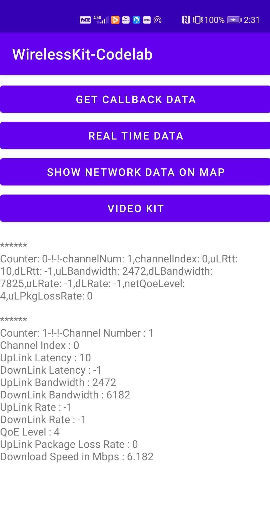

# HiConnection

## Table of Contents

 * [Introduction](#introduction)
 * [Getting Started](#getting-started)
 * [Supported Environments](#supported-environments)
 * [Scenarios](#scenarios)
 * [Result](#result)
 * [License](#license)

## Introduction

The aim of this codelab is to show different use cases of Wireless Kit. To do that, Location Kit, Map Kit and Video Kit are used along with Wireless Kit in this project.

## Getting Started

1. Register as a developer.
Register a [HUAWEI account](https://developer.huawei.com/consumer/en/).
2. Create an app in AppGallery Connect and enable APIs.
3. Build the demo.
To build this demo, please first import the demo to Android Studio (3.X or later). Then download the agconnect-services.json file of the app from AppGallery Connect and add the file to the app directory (\app) of the demo. For details, please refer to [Preparations for Integrating HUAWEI HMS Core](https://developer.huawei.com/consumer/en/codelab/HMSPreparation/index.html).

## Supported Environments

-	Android Studio version: 3.X or later
-	JDK version: 1.8 or later
-	SDK and Gradle:
               minSdkVersion: 21,
               targetSdkVersion: 29,
               compileSdkVersion: 29,
               Gradle version: 3.3 or later.
   If you need to use multiple HMS Core kits, use the latest versions required       for these kits.
-	Test device for Wi-Fi: 
  For details, please refer to https://developer.huawei.com/consumer/en/doc/development/HMSCore-Guides/introduction-0000001050749815

-	Supported devices : https://developer.huawei.com/consumer/en/doc/development/HMSCore-Guides/introduction-0000001050749815#EN-US_TOPIC_0000001050749815__section1864616136120
-	Supported Countries/Regions
  For details, please refer to https://developer.huawei.com/consumer/en/doc/development/HMSCore-Guides-V5/region-0000001050715052-V5.

## Scenarios

- **Get Callback Data :** By pressing callback data button, you will be able to see callback network information on the screen. This information is created when wireless Kit registered.

- **Real Time Data :** By pressing real time data button, you will be able to see real time network information on the screen. This information includes Channel Number, Channel Index, UpLink Latency, DownLink Latency, UpLink Bandwidth, DownLink Bandwidth, UpLink Rate, DownLink Rate, QoE Level, UpLink Package Loss Rate and Download Speed in Mbps.

- **Show Network Data on Map :** By pressing map button, will see the network information on the map. The pin on the map will show the current location of the device. You can see the network information by pressing on the pin.

- **Video Kit :** By pressing video button, you will see a video playing. Before starting the video, the application will check your network information to decide the quality of the video to be played. Therefore, the quality of the video depends on the quality of your network connection.

## Result

- Main screen showing network information after pressing callback and real time data buttons:

- Map screens showing network information on the current location:

  
   

 
 
 

- Video screens showing the quality of the video according to the current downlink bandwith:

## License

This demo is licensed under the [Apache License, version 2.0](http://www.apache.org/licenses/LICENSE-2.0).